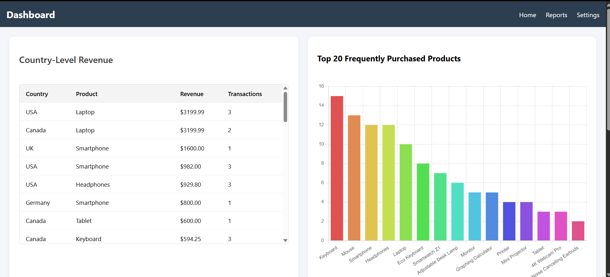
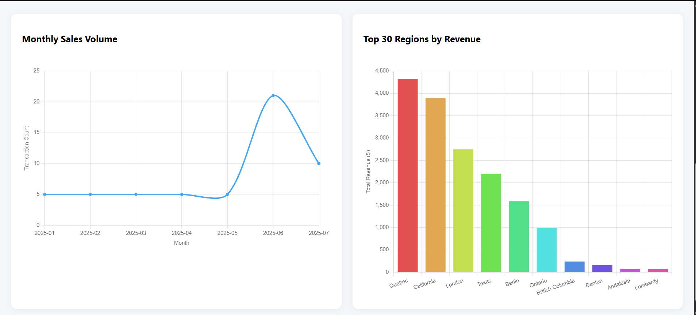

# Analytics Dashboard - Go + Vue.js

A high-performance web-based analytics dashboard that provides key metrics and visual insights based on product transactions. Built with Go (Golang) for the backend and Vue.js for the frontend.

---

## Features

-  Country-Level Revenue Table
-  Top 20 Frequently Purchased Products (Bar Chart)
-  Monthly Sales Volume (Line Chart)
-  Top 30 Regions by Revenue (Bar Chart)
-  RESTful API with CORS enabled
-  Unit-tested backend services and endpoints

---

## Tech Stack

- **Backend:** Go (Gorilla Mux, MySQL driver)
- **Frontend:** Vue.js + Chart.js
- **Database:** MySQL
- **Styling:** CSS3 (Responsive design)

---

## Project Structure

go_dashboard/

├── backend/
│ ├── config/ # DB connection logic
│ ├── models/ # Data structures
│ ├── services/ # Business logic
│ ├── handlers/ # HTTP handlers (controllers)
│ ├── routes/ # API routes
│ └── main.go # Entry point

├── frontend/ # Vue.js dashboard app (created via Vite)
│ ├── components/ # Reusable UI components
│ ├── views/ # Dashboard view
│ └── api.js # Axios API wrapper
├── go.mod
└── README.md

---

## Setup Instructions

### Backend (Go)

1. **Install dependencies**
   ```bash
   go mod tidy

2. **Configure Database** 
    - Create a MySQL database named dashboard_db
    - Use the schema in backend/config/db.go or import it manually.

3. **Run Backend**
   ```bash 
   go run backend/main.go 

   - Server runs at http://localhost:8080

---   

##  Frontend (Vue.js)

**Install dependencies**
   ```bash`
    cd frontend
    npm install    

**Start frontend app**
    ```bash
    npm run dev

## Running Tests
    ```bash`
    go test ./backend/... 


**Includes tests for:**
- Service Layer
- HTTP Handlers
- Routing
- DB Connectivity


---

## Screenshots

###  Dashboard Overview



---

## Sample API Endpoints

Endpoint	                Method	                  Description

/api/country-revenue	       GET	                  Country-level revenue breakdown
---
Endpoint	                Method	                  Description
/api/top-products	          GET	                  Top 20 purchased products
---
Endpoint	                Method	                  Description
/api/monthly-sales	       GET	                  Monthly transaction counts
---
Endpoint	                Method	                  Description
/api/top-regions	          GET	                  Top 30 regions by revenue
   

## Author
Malki Preethimali
